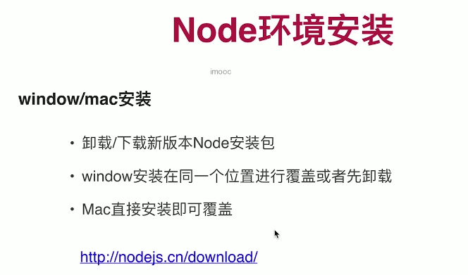
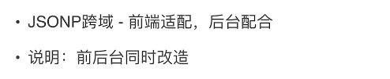
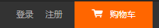

写在前面：

* 暂时搁置，构建了项目结构，看到ch05
* 可能用到的一些收藏夹的东西


VUE全家桶高仿小米商城

教程地址：https://coding.imooc.com/class/chapter/397.html#Anchor

# ch01 课程简介

## 1.1 课程导学


## 1.2 Node环境安装




 

## 1.3 Node升降级

windows中先卸载再安装新版本即可

mac中为如下步骤


# ch02 Git操作

***


## 2.1 Git安装与配置


注释

* --global表示全局配置
* ssh-keygen 生成密钥 -t 表示type。生成公钥和私钥 公钥服务器 私钥本地，访问服务器时相互信任才可以访问

## 2.2 Vscode操作Git

养成良好习惯：输日志


这节讲的不错，可以多看几遍

# ch03 Vue-cli4 安装和使用

## 3.1 Vue-cli4安装


## 3.2 Vue-cli4使用

项目依赖与运行依赖


git提交时不提交node_modules和dist（vscode自动识别）

## 3.3 Vue DevTools使用


# ch04 项目基础架构

讲解前端基本项目架构，通过此章节可搭建一个通用性的前端架构，内容涵盖跨域方案、路由封装、错误拦截等


三种跨域解决方案


## 4.1 跨域-CORS


EasyMock 开源平台，其上的接口可以被任何人调用。是一个CROS跨域的接口。没有做任何的设置。

下面调用一个easymock上的接口为例：

```js
<script>
import axios from 'axios';

export default {
  data (){
    return {
      age:30
    }
  },
  mounted(){
    let url = "https://www.easy-mock.com/mock/5b012c1fe6e1035843cd3aff/mockapi/table/list";//easymock接口
    axios.get(url).then(()=>{

    })
  } 
}
</script>
```

【注】：axios本身一个使用promise的结构，所以我们可以使用then的方式进行链式调用。

对于该请求：

* CORS跨域会有`Access-Control-Allow-Origin` 表示允许前端跨域 ，前端调用它跟普通接口就一样的。


* 指定前端以localhost8080的方式去获取，是动态获取的，可以自行指定。


* 允许前端跨域的时候带上cookie

* EasyMock 开源平台，其上的接口可以被任何人调用，所以本次请求在XHR里可以看到。

## 4.2 跨域-JSONP



本次以请求慕课网上的一个接口为例，使用上文的axios无法请求成功。因为对于请求imooc的某个接口，因为mooc网不允许别人调其网站。

但是使用JSONP可以得到respionse。因为jsonp不是个请求，是一段js脚本，所以可以调用成功。所以在XHR里面没有，在js里面才有

```js
<script>
import axios from 'axios'
import jsonp from 'jsonp'

export default {
  data (){
    return {
      age:30,
      data:'',
    }
  },
  mounted(){
    let url = "https://www.imooc.com/search/hotwords";
    //CROS调用失败
      // axios.get(url).then(()=>{

    // });

    jsonp(url,(err,res)=>{
      let result = res;
      this.data = result;
    });
  } 
}
</script>
```


注意两点:

1. JSONP请求不是一个真正的请求，实际上是一段JS语法，加载一端JS脚本服务器端响应，将信息返回给callback参数来进行回调。
2. jsonp的语法`jsonp(url,(err,res)=>{});` 

## 4.3 跨域-接口代理


在项目中新建vue.config.js整个webpack的一个配置表，传给nodejs服务器来进行设置（注意设置vue.config.js遵循的是commonJS语法，所以导入要使用`module.exports`）

```js
module.exports = {
  devServer:{
    host:'localhost',
    port:8080,
    proxy:{
      '/activity':{
        target:'https://www.imooc.com',
        changeOrigin:true,
        pathRewrite:{
          '/activity':'/activity'
        }
      }
    }
  }
}
```

App.vue中使用

```vue
<script>
import jsonp from 'jsonp'

export default {
  data (){
    return {
      age:30,
      data:'',
    }
  },
  mounted(){
    let url = "/activity/servicetime";
    jsonp(url,(err,res)=>{
      let result = res;
      this.data = result;
    });
  } 
}
</script>
```

因为设置了请求代理，所以请求时用`https://www.imooc.com'`代替`localhost:8080`，这就是请求代理。


## 4.4 需求梳理


前后端对接保证接口层面的规范，例如status一致等


## 4.5 目录结构设置

从设计稿界面中确定路由，组件抽取等


【注】建议把大图片放在public里，小图片放在assets里。

## 4.6 基本插件介绍

根据项目的简单分析安装好插件和依赖，例如：轮播插件，图片懒加载，element-ui(按需加载)，saas预编译器，cookie通信


## 4.7 路由封装

定义router.js,看代码即可

## 4.8 Storage封装


sessionStorage内存存储，随着浏览器的关闭而关闭，不会做持久存储，localStorage浏览器存储


我们期望的storage里的数据格式：


所以我们封装对sessionStorage的操作

```js
/**
 * Storage封装
 */
const  STORAGE_KEY = 'mall';
export default{
  // 存储值
  setItem(key,value,module_name){
    if (module_name){
      let val = this.getItem(module_name);
      val[key] = value;
      this.setItem(module_name, val);
    }else{
      let val = this.getStorage();
      val[key] = value;
      window.sessionStorage.setItem(STORAGE_KEY, JSON.stringify(val));
    }
  },
  // 获取某一个模块下面的属性user下面的userName
  getItem(key,module_name){
    if (module_name){
      let val = this.getItem(module_name);
      if(val) return val[key];
    }
    return this.getStorage()[key];
  },
  getStorage(){
    return JSON.parse(window.sessionStorage.getItem(STORAGE_KEY) || '{}');
  },
  clear(key, module_name){
    let val = this.getStorage();
    if (module_name){
      if (!val[module_name])return;
      delete val[module_name][key];
    }else{
      delete val[key];
    }
    window.sessionStorage.setItem(STORAGE_KEY, JSON.stringify(val));
  }
}
```


## 4.9 接口错误拦截

从三个方面来考虑:


* 统一报错：后台应该分为底层和业务层，底层错误封装成业务层。业务层由前端来展示给用户。
* 登录拦截：
* 请求值，返回值统一处理：例如：如果后端要求的时间格式改变，统一请求值传值时统一处理，表单时间戳请求。在axios里处理。

【注】：vueAxios插件：项目中每个请求的地方都需要先导入axios，再发请求，vueAxios插件的作用作用域对象挂载到vue实例上去，方便使用this调用。

下面是对接口错误拦截的处理：

```js
//插件写上面
import Vue from 'vue'
import axios from 'axios'
import VueAxios from 'vue-axios'
import router from './router.js'
import store from './store'

//组件写下面
import App from './App.vue'

//根据前端的跨域方式做调整 /a/b 访问时变成 /api/a/b
axios.defaults.baseURL = '/api';//接口代理方式
axios.defaults.timeout = 8000;//定义超时时间，提升用户体验

//接口错误拦截
axios.interceptors.response.use(function(response){
  let res = response.data;//取到接口的值,response.data是axios规定的
  if(res.status == 0){
    //status 0 成功
    return res.data;//接口返回的具体值 status data
  }else if(res.status == 10){
    //status 10 未登录拦截
    window.location.href = '/#/login';
  }else{
    alert(res.msg);
  }
});

vue.use(VueAxios.axios);
Vue.config.productionTip = false

new Vue({
  router,
  store,
  render: h => h(App)
}).$mount('#app')
```

## 4.10 接口环境设置


webpackde package.json里面


--mode的参数不能随意去写


新建env.js文件

```js
let baseURL;
switch (process.env.NODE_ENV) {
  case 'development':
    baseURL = 'http://dev-mall-pre.springboot.cn/api';
    break;
  case 'test':
    baseURL = 'http://test-mall-pre.springboot.cn/api';
    break;
  case 'prod':
    baseURL = 'http://mall-pre.springboot.cn/api';
    break;
  default:
    baseURL = 'http://mall-pre.springboot.cn/api';
    break;
}

export default {
  baseURL
}
```

【注】：process.env 获取当前nodeJS进程里的一些环境变量

运行：`npm run serve`

一般分为开发测试，和线上就可以。

## 4.11 Mock设置

为什么要使用Mock？

* 开发阶段，为了高效率，需要提前Mock
* 减少代码冗余，灵活插拔
* 减少沟通，减少接口联调时间


【建议】可以自己搭建一套easy-mock的平台

**本地创建Json**


App.vue里

```js
<script>
import storage from './storage/index'

export default {
  name:'app',
  data (){
    return {
      res:{}
    }
  },
  mounted(){
      //本地加载请求静态json文件的形式
    this.axios.get('/mock/user/login.json').then((res)=>{
      this.res = res;
    });
  } 
}
</script>
```

其实就是请求静态json文件


**easy-mock平台**

通过esay-mock平台实现数据mock

好处：直接创建easy-mock

缺点：因为带宽原因，很容易挂，很卡。

**集成Mock API**

安装mockjs依赖，再使用

MockJs https://www.npmjs.com/package/mockjs

注：import预编译加载；require执行时才去加载

main.js中

```js
//mock开关
const mock = true;
if(mock){
  require('./mock/api')
}
```

mock/api.js

```js
import Mock from 'mockjs'
Mock.mock('/api/user/login',{
  "status": 0,
  "data": {
    "id|10001-11000": 0,
    "username": "@cname",
    "email": "admin@51purse.com",
    "phone": null,
    "role": 0,
    "createTime": 1479048325000,
    "updateTime": 1479048325000
  }
});
```

不会发请求，但是会看到数据，因为发请求之前就拦截了

打开vue就可以看到data


好处：代码污染小

# ch05 商城首页

***

写在前面：


reset.scss 去除浏览器的一些默认样式，覆盖浏览器内置样式

cofig.scss 根据设计稿整理出的全局样式规范表

## 5.1 Nav-Header组件:

**总体预览**


**1. 菜单条**




使用flex布局即可

代码解释：

` <a href="javascirpt:">小米商城</a>`这样写防止页面刷新。

`<style lang="scss">` style的模板的语法是scss

`<div class="container">`container的作用是定义安全距离

**2. 可切换图标MI**


如何为a设置鼠标滑动切换效果，两张图片平铺，使用伪类，before，after来展示两张图片。当鼠标移动控制margin值。过渡的动画使用transition。

**3.搜索框**


scss系统里提取公共部分，新建mixin.scss文件，在里面定义方法，然后在style里调用它。

**4.菜单展开栏**

对于图片，防止变形，要么定义高度，要么定义宽度，例如`width: auto;height: 111px;`，可以让其自适应得展开。

## 5.2 Nav-Footer组件


## 5.3 Service-Bar组件


## 5.4 首页轮播功能实现


## 5.5 首页轮播菜单实现


## 5.6 首页广告位实现


## 5.7 手机商品实现


## 5.8 Model组件实现


## 5.9 Model动画实现


##  5.10 Model交互补充


## 5.11 图片懒加载实现